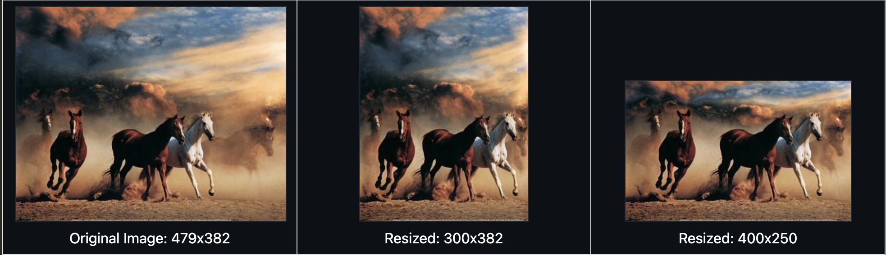

# Seam Carving Image Resizing Program



## Overview

This project is an implementation of an image resizing program using the **seam carving algorithm**. Seam carving allows for **content-aware resizing**, intelligently reducing image size by removing the least important pixels while preserving key visual features.

The program processes images in the PPM format and is capable of adjusting both width and height dimensions, minimizing distortion to essential visual content.

## Features

- **Content-Aware Resizing**: Uses seam carving to intelligently resize images while preserving important visual elements.
- **PPM Image Processing**: Supports reading, writing, and processing images in the PPM format.
- **Modular Implementation**:
  - `Matrix` and `Image` Abstract Data Types (ADTs) for representing and manipulating images.
  - `Processing` module for computing image energy and removing seams.

## Getting Started

### Prerequisites

- C++17 compiler
- `libjpeg-turbo` (optional) for JPEG support
- Make utility (`make`) for building the project

### Setup

1. **Clone the repository**:

   ```sh
   git clone https://github.com/your-username/seam-carving.git
   cd seam-carving
